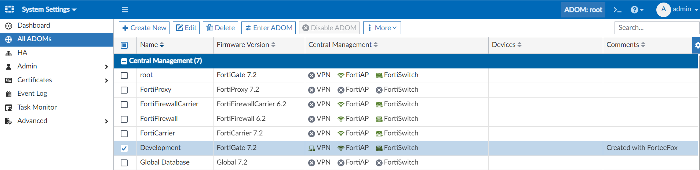
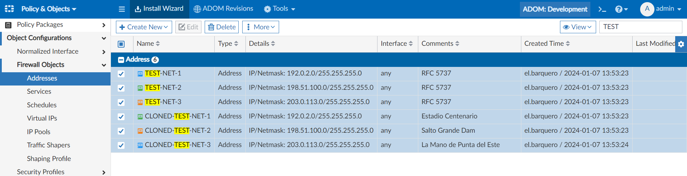
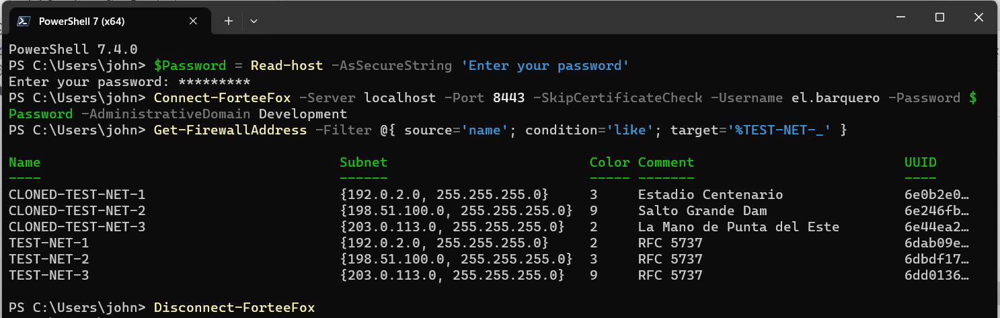
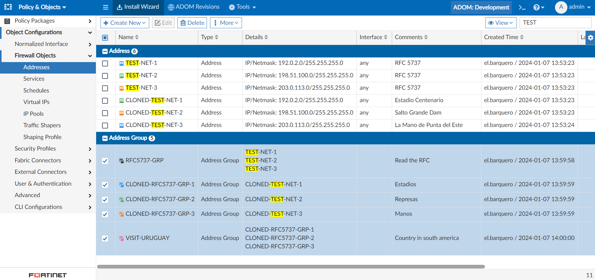

# ForteeFox

ForteeFox is a PowerShell module for FortiManager currently it supports adding, cloning, retrieving, updating and removing firewall addresses of type ipmask and groups. For groups you can also add and remove members.

## Table of Contents

- [Installation](#installation)
- [Usage](#usage)
- [Examples](#examples)

## Installation

TBD.

### Prerequisites

- [x] Access to FortiManager 7.x
- [x] User account with JSON API Access in FortiManager
- [x] PowerShell 7.x

To setup an user account with JSON API Access

1. Login to the FortiManager
2. Navigate to System Settings -> Admin -> Administrators -> Create New
3. Set Admin_Profile to either Standard_User or Restricted_User depending on your needs. 
4. Set JSON API Access to either Read-Write or Read depending on your needs.

## Usage

To use ForteeFox, follow these steps:

1. Connect to FortiManager using [Connect-ForteeFox](docs/Connect-ForteeFox.md)
2. Use one or more cmdlets from the ForteeFox module. To see available cmdlets use the Get-Command
3. Disconnect from FortiManager using [Disconnect-ForteeFox](docs/Disconnect-ForteeFox.md)

```powershell
Get-Command -Module ForteeFox
```

## Examples

### Example 1: Create administrative domain (ADOM)

This example uses the [New-AdministrativeDomain](docs/New-AdministrativeDomain.md) cmdlet to create an administrative domain called 'Development'

```powershell
$Password = Read-host -AsSecureString 'Enter your password'
Connect-ForteeFox -Server localhost -Port 8443 -SkipCertificateCheck -Username el.barquero -Password $Password -AdministrativeDomain 'root'
New-AdministrativeDomain -Name 'Development' -Description 'Created with ForteeFox'
Disconnect-ForteeFox
```



### Example 2: Create and manipulate firewall address objects

This example show how to use the various cmdlets regarding firewall address. To Remove a firewall address use [Remove-FirewallAddress](docs/Remove-FirewallAddress.md)

- Create three firewall address subnets with color and comments using [New-FirewallAddress](docs/New-FirewallAddress.md)
- Clone the addresses three times using [Copy-FirewallAddress](docs/Copy-FirewallAddress.md)
- Manipulates the color and comments of the cloned addresses using [Set-FirewallAddress](docs/Set-FirewallAddress.md)
- Retrieve firewall address object using [Get-FirewallAddress](docs/Get-FirewallAddress.md)

```powershell
$Password = Read-host -AsSecureString 'Enter your password'
Connect-ForteeFox -Server localhost -Port 8443 -SkipCertificateCheck -Username el.barquero -Password $Password -AdministrativeDomain Development
New-FirewallAddress -Name 'TEST-NET-1' -Type 'ipmask' -Subnet '192.0.2.0/24' -Color 2 -Comment 'RFC 5737'
New-FirewallAddress -Name 'TEST-NET-2' -Type 'ipmask' -Subnet '198.51.100.0/24' -Color 3 -Comment 'RFC 5737'
New-FirewallAddress -Name 'TEST-NET-3' -Type 'ipmask' -Subnet '203.0.113.0/24' -Color 9 -Comment 'RFC 5737'
Get-FirewallAddress -Name 'TEST-NET-1' | Copy-FirewallAddress -CloneName 'CLONED-TEST-NET-1'
Copy-FirewallAddress -Name 'TEST-NET-2' -CloneName 'CLONED-TEST-NET-2'
Get-FirewallAddress -Name 'TEST-NET-3' | Copy-FirewallAddress -CloneName 'CLONED-TEST-NET-3' -Color 32 -Comment 'La Mano de Punta del Este' -PassThru
Get-FirewallAddress -Name 'CLONED-TEST-NET-1' | Set-FirewallAddress -Comment 'Estadio Centenario' -Color 3
Set-FirewallAddress -Name 'CLONED-TEST-NET-2' -Color 9 -Comment 'Salto Grande Dam'
Set-FirewallAddress -Name 'CLONED-TEST-NET-3' -Color 2 -Comment 'La Mano de Punta del Este' -PassThru
Disconnect-ForteeFox
```



### Example 3: Retrieve firewall address objects using filter.

This example uses the [Get-FirewallAddress](docs/Get-FirewallAddress.md) cmdlet using FortiManager filter syntax.

```powershell
$Password = Read-host -AsSecureString 'Enter your password'
Connect-ForteeFox -Server localhost -Port 8443 -SkipCertificateCheck -Username el.barquero -Password $Password -AdministrativeDomain Development
Get-FirewallAddress -Filter @{ source='name'; condition='like'; target='%TEST-NET-_' }
Disconnect-ForteeFox
```



### Example 4: Create and manipulate firewall address group objects

This example show how to use the various cmdlets regarding firewall address groups. To Remove a firewall address group use the [Remove-FirewallAddressGroup](docs/Remove-FirewallAddressGroup.md)

- Create one group called 'RFC5737-GRP' with comment using [New-FirewallAddressGroup](docs/New-FirewallAddressGroup.md)
- Clone the group three times using [Copy-FirewallAddressGroup](docs/Copy-FirewallAddressGroup.md)
- Manipulates the color and comments of the cloned groups using [Set-FirewallAddressGroup](docs/Set-FirewallAddressGroup.md)
- Adding member to the cloned groups using [Add-FirewallAddressGroupMember](docs/Add-FirewallAddressGroupMember.md)
- Retrieve firewall address objects by filter using [Get-FirewallAddressGroup](docs/Get-FirewallAddressGroup.md), and remove members by using the [Remove-FirewallAddressGroupMember](docs/Remove-FirewallAddressGroupMember.md)
- Create one group called 'VISIT-URUGUAY' and use the cloned groups as members 

```powershell
$Password = Read-host -AsSecureString 'Enter your password'
Connect-ForteeFox -Server localhost -Port 8443 -SkipCertificateCheck -Username el.barquero -Password $Password -AdministrativeDomain Development
New-FirewallAddressGroup -Name 'RFC5737-GRP' -Member 'TEST-NET-1', 'TEST-NET-2', 'TEST-NET-3' -Comment 'Read the RFC'
Get-FirewallAddressGroup -Name 'RFC5737-GRP' | Copy-FirewallAddressGroup -CloneName 'CLONED-RFC5737-GRP-1' -Color 2 -Comment 'Estadios'
Copy-FirewallAddressGroup -Name 'RFC5737-GRP' -CloneName 'CLONED-RFC5737-GRP-2' -Comment 'Represas'
Copy-FirewallAddressGroup -Name 'RFC5737-GRP' -CloneName 'CLONED-RFC5737-GRP-3' -Color 9
Set-FirewallAddressGroup -Name 'CLONED-RFC5737-GRP-2' -Color 3
Set-FirewallAddressGroup -Name 'CLONED-RFC5737-GRP-3' -Comment 'Manos'
Add-FirewallAddressGroupMember -Name 'CLONED-RFC5737-GRP-1' -Member @('CLONED-TEST-NET-1')
Add-FirewallAddressGroupMember -Name 'CLONED-RFC5737-GRP-2' -Member @('CLONED-TEST-NET-2')
Add-FirewallAddressGroupMember -Name 'CLONED-RFC5737-GRP-3' -Member @('CLONED-TEST-NET-3')
Get-FirewallAddressGroup -Filter  @{ source='name'; condition='like'; target='%CLONED-RFC5737-GRP-_' } | Remove-FirewallAddressGroupMember -Member @('TEST-NET-1', 'TEST-NET-2', 'TEST-NET-3')
New-FirewallAddressGroup -Name 'VISIT-URUGUAY' -Member @('CLONED-RFC5737-GRP-1', 'CLONED-RFC5737-GRP-2', 'CLONED-RFC5737-GRP-3') -Color 24 -Comment 'Country in south america'
Disconnect-ForteeFox
```


